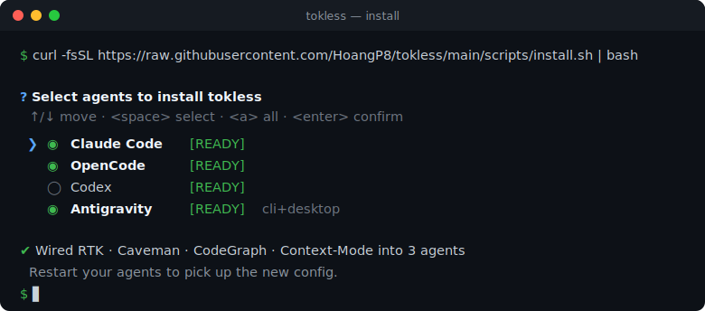

<div align="center">
  

  **Save tokens on AI coding agents — no performance loss.**

  One tool, no config — works the moment it lands.

  [](https://github.com/HoangP8/tokless/releases)
  [](https://github.com/HoangP8/tokless)
  [](https://github.com/HoangP8/tokless/blob/main/LICENSE)

  <br />
  <br />

  | 📅 Next week plan (22/6 - 28/6) |
  | :--- |
  | <ul><li>Fix Codex & AGY hooks for better MCP (codegraph + context-mode) compliance rate</li><li>Add Pi support</li><li>Add Cursor support</li></ul> |
</div>

## Introduction

> *Saving tokens shouldn't be complicated. Many great plugins exist to help coding agents save context and perform better — but setting them up and keeping them updated is hard, especially for non-technical users.*

**tokless** is the lazy solution. One command, pick your agent, restart — IDE and CLI both wired. Cross-platform: macOS, Linux, Windows. No config, no manual edits, re-runnable.

## Supported Agents

<div align="center">
  <table>
    <tr>
      <td align="center" width="140">
        <br/>
        <b>Claude Code</b><br/>
        <sub>Anthropic</sub>
      </td>
      <td align="center" width="140">
        <br/>
        <b>OpenCode</b><br/>
        <sub>anomalyco</sub>
      </td>
      <td align="center" width="140">
        <br/>
        <b>Codex</b><br/>
        <sub>OpenAI</sub>
      </td>
      <td align="center" width="140">
        <br/>
        <b>Antigravity</b><br/>
        <sub>Google</sub>
      </td>
    </tr>
  </table>
</div>

Each agent wired per its own config spec. Pick one, some, or all:

```bash
tokless                              # interactive: pick agents
tokless --agents claude,opencode     # wire just these
tokless --agents claude,opencode,codex,antigravity  # all
```

## Tools


| Tool | What it does | Example |
| ---- | ------------ | ------- |
| [RTK](https://github.com/rtk-ai/rtk) | Trims noisy bash/tool output | `ls -la` 45 lines (~800 tok) → `rtk ls` 12 lines (~150 tok) |
| [Caveman](https://github.com/JuliusBrussee/caveman) | Makes the agent answer in terse prose | 69-tok explanation → 19-tok answer (`useMemo`) |
| [CodeGraph](https://github.com/colbymchenry/codegraph) | Query a code graph, skip whole-file reads | 1 `codegraph explore` call = 0 file reads on 25,874-file repo |
| [Context-Mode](https://github.com/mksglu/context-mode) | Run heavy work in a sandbox, return only what matters | 700KB log → 3KB summary, raw bytes never enter context |

Each tool from official source. Each targets a different waste source — no overlap, no conflict.

## Install



macOS / Linux:
```bash
curl -fsSL https://raw.githubusercontent.com/HoangP8/tokless/main/scripts/install.sh | bash
```

Windows (PowerShell):
```powershell
irm https://raw.githubusercontent.com/HoangP8/tokless/main/scripts/install.ps1 | iex
```

## Commands

```
tokless              Install + wire everything (default; safe to re-run)
tokless update       Show version diff, upgrade the four tools
tokless doctor       Show what's wired; warn about broken bits
tokless uninstall    Remove everything tokless touched
tokless self-update  Update the tokless CLI itself
```

Flags:
```
--agents <list>   Subset: claude,opencode,codex,antigravity
--dry-run         Preview, no writes
--verbose         Every step
```

Restart agents after install so they pick up new config.
